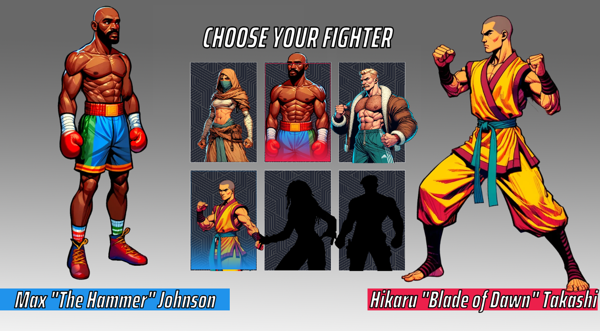
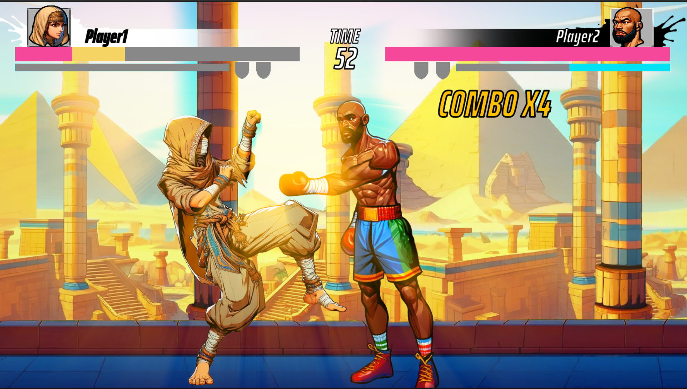

# ProjectStrike - 2D Arcade Fighter

## 🎬 Demo Video
[](https://www.youtube.com/watch?v=twb9WMOnHXs)

## 📸 Screenshots
<div align="center">
  
  
</div>

## Overview

**ProjectStrike** is a dynamic 2D arcade fighting game built in Unity as a **University Graduation Project**, featuring custom Spine 2D animations and AI-generated artwork. Experience intense combat with fluid character movements, strategic combo systems, and intelligent AI opponents across beautifully crafted environments.

This project showcases advanced game development techniques including sophisticated AI behavioral systems, professional 2D skeletal animation integration, and modern Unity development practices.

## 🎮 Features

### Core Gameplay
- **Fast-paced 2D Combat**: Classic arcade fighter mechanics with modern polish
- **3-Attack Combat System**: Light punch, heavy punch, and kick attacks with unique properties
- **Combo System**: Chain attacks together for devastating combos with visual feedback
- **Block & Counter**: Strategic blocking system with block health mechanics
- **Ultimate Abilities**: Energy-based special moves that can turn the tide of battle
- **Health & Energy Management**: Balanced resource system for strategic gameplay

### Characters & Animation
- **Custom Spine 2D Animations**: Fluid, professional-grade character animations
- **Dynamic State Management**: Seamless transitions between idle, movement, attack, and hit states
- **Character Facing System**: Automatic character orientation based on opponent position
- **Death & Victory Animations**: Dramatic finishing sequences

### AI System
- **Intelligent AI Controller**: Advanced AI with multiple behavioral states
- **Adaptive Combat Patterns**: AI adjusts strategy based on distance and combat situation
- **Attack Pattern Variations**: Randomized attack sequences for unpredictable gameplay
- **Defensive Behaviors**: Smart blocking and evasion mechanics
- **Proximity-based Decision Making**: AI behavior changes based on player distance

### Levels & Environments
- **Multiple Arenas**: 
  - 🏺 **Egypt** - Ancient desert battleground
  - 🌸 **Japan** - Traditional Japanese setting
  - 🏔️ **Siberia** - Frozen wilderness arena
  - 🏙️ **New York** - Urban cityscape battlefield
- **AI-Generated Artwork**: Stunning backgrounds created with artificial intelligence
- **Dynamic Loading Screens**: Custom loading sequences between battles

### Technical Features
- **Unity 2D Physics**: Robust collision detection and movement system
- **Spine Integration**: Professional 2D skeletal animation support
- **Audio System**: Dynamic sound effects and music management
- **Input Management**: Responsive control system with customizable inputs
- **Network Support**: Built-in networking capabilities for future multiplayer expansion
- **Scene Management**: Smooth transitions between menus, levels, and cutscenes

## 🎯 Gameplay Mechanics

### Combat System
- **Attack Types**:
  - **Light Punch (Attack1)**: Quick jabs for building combos
  - **Heavy Punch (Attack2)**: Slower but more powerful strikes
  - **Kick (Attack3)**: High damage attacks with unique properties
- **Combo Counter**: Visual feedback showing current combo multiplier
- **Energy System**: Build energy through combat to unleash ultimate abilities
- **Block System**: Timed blocking reduces damage and builds strategic advantage

### AI Behavioral States
- **Normal State**: Balanced approach with mixed offense/defense
- **Close Combat State**: Aggressive up-close fighting
- **Aggressive State**: High-pressure offensive tactics
- **Defensive State**: Focus on blocking and counter-attacks
- **Reset State**: Transitional state for AI decision making

## 🛠️ Technical Stack

- **Engine**: Unity 2D
- **Animation**: Spine 2D Runtime
- **Graphics**: AI-generated artwork + custom UI elements
- **Audio**: Unity Audio System
- **Input**: Unity Input System
- **Networking**: Unity Netcode (future-ready)
- **Version Control**: Git
```

## 🚀 Getting Started

### Prerequisites
- Unity 2022.3 LTS or later
- Spine Unity Runtime (included)
- Git for version control


## 🎨 Art & Animation

### Spine 2D Integration
- Professional skeletal animation system
- Smooth interpolation between animation states
- Event-driven animation triggers for combat timing
- Modular animation system for easy character expansion

### AI-Generated Artwork
- Unique backgrounds for each fighting arena
- Consistent art style across all environments
- High-resolution artwork optimized for Unity

## 🤖 AI Features

The AI system features sophisticated behavior patterns:
- **Distance-based Strategy**: AI adapts tactics based on proximity to player
- **Attack Pattern Recognition**: Varied combo sequences prevent predictability
- **Defensive Intelligence**: Smart blocking and evasion based on player behavior
- **Difficulty Scaling**: Adjustable aggression and reaction times

## 🔧 Development Notes

### Key Systems
- **State Management**: Centralized character state handling for consistent behavior
- **Animation Events**: Spine animations trigger gameplay events (damage colliders, sound effects)
- **Modular Design**: Easy to add new characters, moves, and levels

### Performance Optimization
- Efficient 2D physics with optimized collision detection
- Spine animation culling and LOD system
- Audio pooling for sound effect management
- Texture compression for mobile deployment readiness

## 🎵 Audio

- Dynamic sound effects for all combat actions
- Atmospheric background music for each environment
- Audio mixing system for balanced gameplay experience

## 📜 License

This project is a personal University Graduation game development project. All assets and code are for demonstration purposes.
